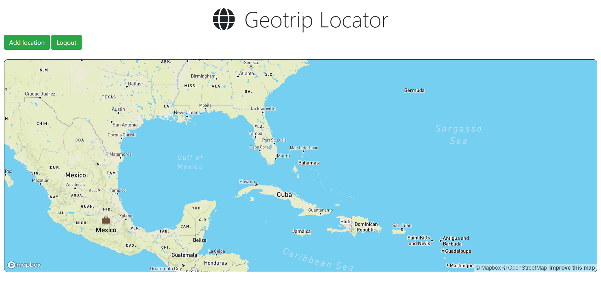

# Geotrip 🌍

<p align="center">
   
</p>

<!-- ABOUT THE PROJECT -->

## Built With

- UI + Backend: EJS Templating Engine, CSS | Node.js + Express.js
- Libs + Frameworks: Mongoose, Auth0
- API + Packages: Mapquest API, Node Geocoder
- DB: MongoDB Atlas
---

## Screenshots

<details>
    <summary>Auth Landing Page</summary>
    
</details>
<details>
    <summary>Auth Screen</summary>
    
</details>
<details>
    <summary>Home Page</summary>
    
</details>
<details>
    <summary>Add Location Modal</summary>
    
</details>

<!-- BUILT WITH -->  

## How to Install Locally

**1. Fork and clone this repository**

   ```
   git clone https://github.com/sandip2224/Geotrip.git
   cd Geotrip/
   ```  
   
**2. Install required dependancies/dev dependancies**  

   ```
   yarn
   ```  
**3. Create a .env file in root directory and add**  

  ```
MONGO_URI=XXXXXXXX
GEOCODER_PROVIDER=mapquest
GEOCODER_API_KEY=XXXXXXXX
ISSUER_BASE_URL=XXXXXXXX
CLIENT_ID=XXXXXXXX
BASE_URL=http://localhost:3000
SECRET=XXXXXXXX
  ```

**4. Run server in development mode at `localhost:3000`**  

  ```
  yarn dev
  ```
  
---

## Contributing

If you'd like to contribute, please **fork** the repository and then raise a PR with necessary changes. Thank you.

---

## 🤎 Found this project interesting?

If you found this project useful, then please leave a :star: on Github💔.

---

## 👨 Maintainer
  - [Sandipan Das](https://linkedin.com/in/sandipan0164/)
